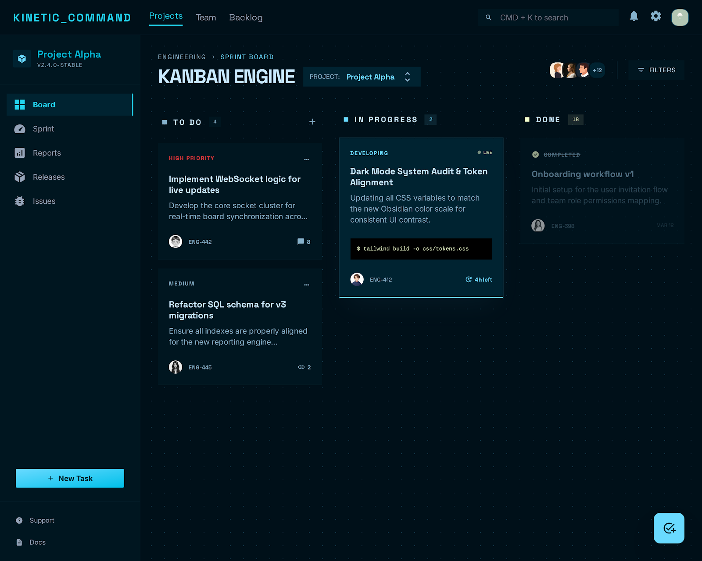

# KINETIC COMMAND

A self-hosted kanban board with a REST API backend, styled with the **Organic Brutalism** design system. Data lives on your server in flat JSON files — no database required.



---

## Stack

| Layer | Technology |
|---|---|
| UI | React 18 + Vite 6 |
| Styling | Tailwind CSS v3 |
| Drag & Drop | @dnd-kit/core + @dnd-kit/sortable |
| Backend | Express (Node 20) |
| Storage | JSON files on disk |
| MCP | @modelcontextprotocol/sdk |

---

## Running Locally (dev)

```bash
npm install

# Terminal 1 — Vite frontend (hot reload)
npm run dev          # http://localhost:5173

# Terminal 2 — Express API + data server
npm run server       # http://localhost:7429
```

The Vite dev server proxies `/api` requests to the Express server.
In dev mode the frontend hits `http://localhost:7429` directly.

---

## Running with Docker

The recommended way to run in production.

```bash
docker compose up -d
```

This builds the image, starts the container, and persists data in a named Docker volume (`kanban-data`).

The app is served at **http://localhost:7429**.

### Changing the port

Edit [docker-compose.yml](docker-compose.yml):

```yaml
ports:
  - "YOUR_PORT:7429"   # change the left side only
```

Or set it as an environment variable and update both sides:

```yaml
ports:
  - "8080:8080"
environment:
  - PORT=8080
```

### Data persistence

Data is stored in the `kanban-data` Docker volume at `/data` inside the container.
Two files are written: `projects.json` and `tasks.json`.

To point to a host directory instead:

```yaml
volumes:
  - ./my-data:/data
```

### Useful Docker commands

```bash
docker compose up -d          # start in background
docker compose down           # stop and remove container
docker compose logs -f        # follow logs
docker compose build --no-cache   # rebuild image from scratch
```

---

## Running without Docker (production build)

```bash
npm install
npm run build        # compiles frontend to dist/
npm start            # serves frontend + API on port 7429
```

Set environment variables to configure:

```bash
PORT=8080 DATA_PATH=./data npm start
```

---

## Environment Variables

| Variable | Default | Description |
|---|---|---|
| `PORT` | `7429` | Port the Express server listens on |
| `DATA_PATH` | `/data` | Directory where `projects.json` and `tasks.json` are written |
| `NODE_ENV` | — | Set to `production` to disable dev-only tooling |

---

## REST API

The Express server exposes a JSON API under `/api`.

| Method | Endpoint | Description |
|---|---|---|
| GET | `/api/projects` | List all projects |
| POST | `/api/projects` | Create a project `{ name }` |
| GET | `/api/tasks` | List all tasks (optional `?projectId=` filter) |
| POST | `/api/tasks` | Create a task `{ projectId, title, description?, status?, dueDate? }` |
| PUT | `/api/tasks/:id` | Update a task |
| DELETE | `/api/tasks/:id` | Delete a task |

---

## MCP Server

KINETIC COMMAND ships an [MCP](https://modelcontextprotocol.io) server that lets Claude (or any MCP-compatible AI) read and write the board directly.

### Setup

The MCP server is at [mcp/server.js](mcp/server.js). It connects to the running kanban API over HTTP.

#### Claude Code / Claude Desktop

Add this to your `.mcp.json` (already included in this repo):

```json
{
  "mcpServers": {
    "kanban": {
      "command": "node",
      "args": ["./mcp/server.js"],
      "env": {
        "KANBAN_URL": "http://localhost:7429"
      }
    }
  }
}
```

If the kanban server runs on a different port, update `KANBAN_URL` accordingly.

#### Claude Desktop (global config)

Add to `~/Library/Application Support/Claude/claude_desktop_config.json` (macOS) or `%APPDATA%\Claude\claude_desktop_config.json` (Windows):

```json
{
  "mcpServers": {
    "kanban": {
      "command": "node",
      "args": ["/absolute/path/to/kanban/mcp/server.js"],
      "env": {
        "KANBAN_URL": "http://localhost:7429"
      }
    }
  }
}
```

### Available MCP tools

| Tool | Description |
|---|---|
| `list_projects` | List all projects |
| `create_project` | Create a project by name |
| `get_tasks` | Get all tasks, optionally filtered by `projectId` |
| `create_task` | Create a task with title, description, status, dueDate |
| `update_task` | Update any field on an existing task |

---

## Project Structure

```
src/                    — React frontend
  db.js                 — API client (replaces IndexedDB)
  App.jsx               — top-level state and event handlers
  components/
    Board.jsx           — board header, export/import controls
    Lane.jsx            — droppable lane
    TaskCard.jsx        — sortable card
    CardModal.jsx       — add/edit task form
    ProjectModal.jsx    — project CRUD modal

server/                 — Express backend
  server.js             — HTTP server, static file serving
  app.js                — Express app, route registration
  fileStorage.js        — JSON file read/write (projects + tasks)
  api/                  — route handlers

mcp/
  server.js             — MCP server (stdio transport)

Dockerfile              — multi-stage build (Node 20 Alpine)
docker-compose.yml      — single-service compose config
```

---

## Features

- **Multiple projects** — create, rename, and delete projects
- **Three fixed lanes** — Todo, In Progress, Done
- **Task cards** — title, description, and due date per card
- **Drag & drop** — reorder cards within and across lanes
- **Persistent storage** — data written to JSON files on the server
- **Export / Import** — back up and restore board data as JSON
- **MCP integration** — AI agents can read and write the board via MCP tools
